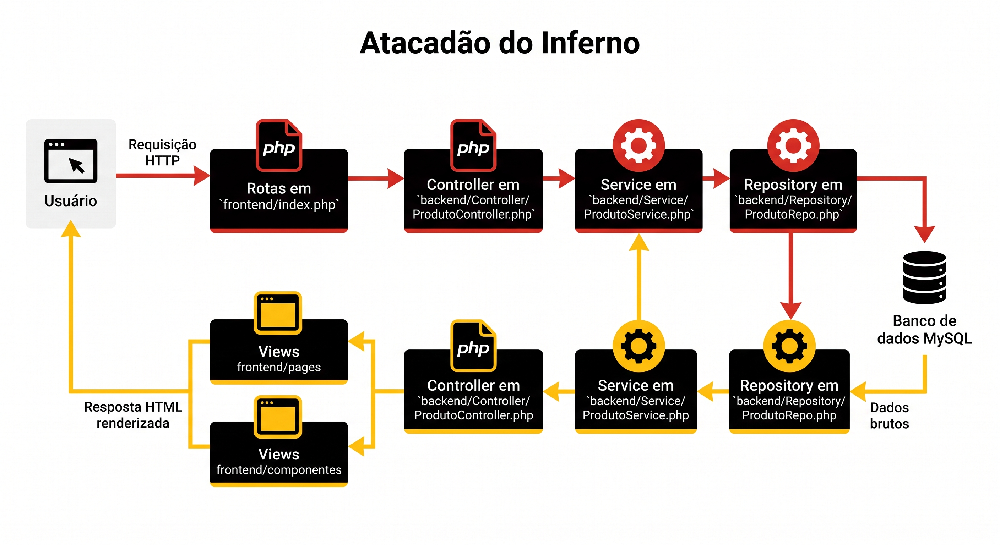

# ATACADÃO DO INFERNO (Trabalho Docker 1º Bimestre)


## Como instalar e rodar o projeto
1 - clone o projeto
```bash
git clone https://github.com/ELTAILS/trabalho_docker_1_bimestre
```

2 - entre na pasta do projeto
```bash
cd trabalho_docker_1_bimestre
```

3 - instale as dependências
```bash
composer install
```

4 - rode o projeto
```bash
docker compose up -d
```

5 - faça a copia de dados do banco de dados:
    1 - abra a pasta backend depois Database e copie o produtos.sql
    2 - abra o localhost:8001 e coloque as credinciais validas
    3 - abra o sql e cole o produtos.sql e execute
    4 - visualize os dados na tabela produtos

## Sobre o projeto e suas tecnologias
O Atacadão do Inferno é um sistema web para cadastro e controle de produtos de um mercado. Com ele, é possível listar produtos, consultar detalhes, cadastrar novos itens, atualizar informações e excluir produtos.

O projeto foi desenvolvido com:

- **PHP 8.3** para o back-end e as páginas do sistema;
- **MySQL 8.4** para armazenar os produtos;
- **PDO** para realizar a conexão com o banco de dados;
- **Composer** para o autoload das classes;
- **Docker Compose** para executar o PHP, o MySQL e o phpMyAdmin em containers;
- **HTML, CSS e Bootstrap** para a interface.

## Objetivo do projeto
O objetivo é praticar a criação de uma aplicação CRUD usando a arquitetura MVC. CRUD significa:

- **Create:** cadastrar um produto;
- **Read:** visualizar os produtos cadastrados;
- **Update:** atualizar os dados de um produto;
- **Delete:** excluir um produto.

A separação em camadas deixa o código mais organizado: cada parte do sistema tem uma responsabilidade e pode ser alterada com mais facilidade.

### Organização MVC

```text
Usuário
    ↓
Rotas - frontend/index.php
    ↓
Controller - backend/Controller/ProdutoController.php
    ↓
Service - backend/Service/ProdutoService.php
    ↓
Repository - backend/Repository/ProdutoRepo.php
    ↓
MySQL - banco atacadao
    ↓
View - frontend/pages e frontend/componentes
```

### fluxo do projeto



## Programadores

Este projeto foi desenvolvido por:

- [Wagner](https://github.com/ELTAILS)
- [Hiago](https://github.com/HiagoRissatto)
- [Adrian](https://github.com/PEN-g-UIM)

## Meme do projeto

Depois de configurar o Docker e conectar o banco, a sensação é esta:

